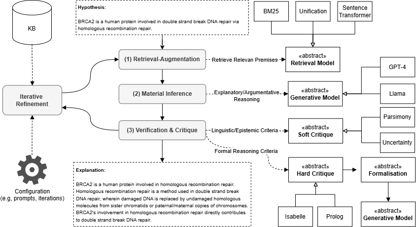

# PEIRCE: Unifying Material and Formal Reasoning via LLM-Driven Neuro-Symbolic Refinement

A persistent challenge in AI is the effective integration of material and formal inference - the former concerning the plausibility and contextual relevance of arguments, while the latter focusing on their logical and structural validity. Large Language Models (LLMs), by virtue of their extensive pre-training on large textual corpora, exhibit strong capabilities in material inference. However, their reasoning often lacks formal rigour and verifiability. At the same time, LLMs’ linguistic competence positions them as a promising bridge between natural and formal languages, opening up new opportunities for combining these two modes of reasoning. We introduce PEIRCE, a neuro-symbolic framework designed to unify material and formal inference through an iterative conjecture–criticism process. Within this framework, LLMs play the central role of generating candidate solutions in natural and formal languages, which are then evaluated and refined via interaction with external critique models. These critiques include symbolic provers, which assess formal validity, as well as soft evaluators that measure the quality of the generated arguments along linguistic and epistemic dimensions such as plausibility, coherence, and parsimony. While PEIRCE is a general-purpose framework, we demonstrate its capabilities in the domain of natural language explanation generation - a setting that inherently demands both material adequacy and formal correctness

High-level overview of the framework:



## Demonstrations

To get you familiar with PEIRCE, we released a list of demonstrations showcasing the applicability of the framework to different NLI tasks and domains:

- Refinement with hard and soft critiques, [link](https://github.com/neuro-symbolic-ai/peirce/blob/main/Soft%20and%20Hard%20Critiques.ipynb)
- LLMs-Symbolic Explanation Refinement (with hard Isabelle critique), [link](https://github.com/neuro-symbolic-ai/peirce/blob/main/Neuro-Symbolic%20Explanation%20Refinement.ipynb)
- Inference to the Best Explanation in Large Language Models (with soft critiques), [link](https://github.com/neuro-symbolic-ai/peirce/blob/main/Inference%20to%20the%20Best%20Explanation.ipynb)
- Hybrid Inductive Logic Programming (with hard Prolog critique), [link](https://github.com/neuro-symbolic-ai/peirce/blob/main/Hybrid%20Inductive%20Logic%20Programming.ipynb)
- Explanation Retrieval and Explanatory Unification Patterns, [link](https://github.com/neuro-symbolic-ai/peirce/blob/main/Explanation%20Retrieval.ipynb).

## Install Dependencies

### Python Libraries

To install all the required Python libraries for running PEIRCE, clone the repository locally and execute the following command:

```bash
pip install -r requirements.txt
```

### Data Model

To integrate different explanation-centred NLI datasets with PEIRCE, we implemented a separate Python package called SSKB: `pip install sskb`


### Critique Models

To use the soft critique models, first install spaCy’s English model by running:

```bash
python -m spacy download en_core_web_sm
```

Some critique models use external solvers that need a separate installation. To install prolog solver, please follow the instructions below.

#### Prolog Solver Installation:

```bash
sudo add-apt-repository ppa:swi-prolog/stable
sudo apt-get update
sudo apt-get install swi-prolog
pip install -U pyswip
```

To install Isabelle, please follow the instructions below.

#### Isabelle Linux Installation:

Download Isabelle2023 in your working directory (e.g., Desktop):

```bash
wget https://isabelle.in.tum.de/website-Isabelle2023/dist/Isabelle2023_linux.tar.gz
tar -xzf Isabelle2023_linux.tar.gz --no-same-owner
```

Append Isabelle2023's bin directory to your PATH
```bash
export PATH=$PATH:/workspace/Isabelle2023/bin 
```

#### Isabelle macOS Installation:

Download Isabelle2023/2024 for macOS from the official website: https://isabelle.in.tum.de/

Append Isabelle2023's bin directory to your PATH
```bash
export PATH=$PATH:/Users/user/Desktop/Isabelle2023.app/bin
```
#### Isabelle python notebook:

When using isabelle-client inside Jupyter, both Jupyter and isabelle-client rely on asyncio, requiring nested event loops to be enabled. This step is not necessary when running isabelle-client from standalone Python scripts outside of Jupyter.

```
import nest_asyncio
nest_asyncio.apply()
import os
original_path = os.environ.get('PATH', '')
new_path = original_path + ':/workspace/Isabelle2023/bin'
os.environ['PATH'] = new_path
print(os.environ['PATH'])
```

#### API Keys
Set your `api_key` in the `config.yaml` file to use the generative models.

## Bibtex

If you find this repository useful, please consider citing our demo paper. 

'''
@misc{quan2025peirceunifyingmaterialformal,
      title={PEIRCE: Unifying Material and Formal Reasoning via LLM-Driven Neuro-Symbolic Refinement}, 
      author={Xin Quan and Marco Valentino and Danilo S. Carvalho and Dhairya Dalal and André Freitas},
      year={2025},
      eprint={2504.04110},
      archivePrefix={arXiv},
      primaryClass={cs.AI},
      url={https://arxiv.org/abs/2504.04110}, 
}
'''

